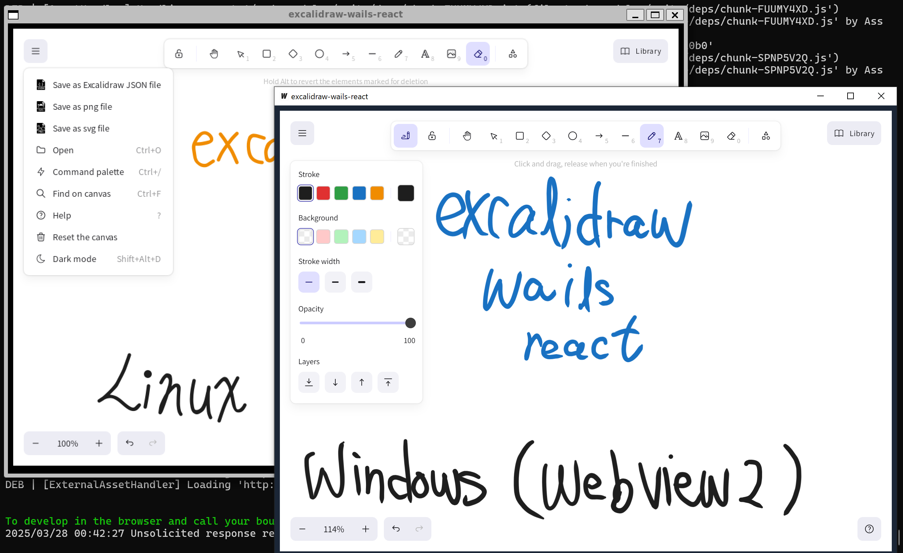

# README

## About

This is a simple **Excalidraw desktop app** using **Wails React-TS template**.

- Excalidraw: [https://docs.excalidraw.com/docs/@excalidraw/excalidraw/installation](https://docs.excalidraw.com/docs/@excalidraw/excalidraw/installation)
- Wails: [https://wails.io/ja/](https://wails.io/ja/)





## How to use

### Install dependencies

see : [https://wails.io/ja/docs/gettingstarted/installation](https://wails.io/ja/docs/gettingstarted/installation)

- Go 1.20+
- NPM (Node 15+)

then run:

```shell
go install github.com/wailsapp/wails/v2/cmd/wails@latest

# check dependencies
wails doctor
```


### Settig up

```shell
# download repo
git clone https://github.com/EaGitro/excalidraw-wails-react.git

cd excalidraw-wails-react

# install npm packages
cd frontend

npm i 

cd ..
```


### run in a "live development" mode

```shell
wails dev
```

Consider changing the go version in `go.mod` to your go version, if the error `toolchain not available` occurs.

```shell
# shell
> wails dev
Wails CLI v2.10.1

Executing: go mod tidy
go: downloading go1.23 (windows/amd64)
go: download go1.23 for windows/amd64: toolchain not available

exit status 1

  ERROR   exit status 1

> go version
go version go1.21.4 windows/amd64
```

```go
///////////////
// go.mod
///////////////

module excalidraw-wails-react

// go 1.23  ==> go 1.21
go 1.21
```

## Building

To build a redistributable, production mode package, use `wails build`.
